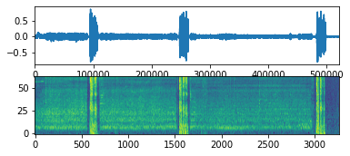

---
    
# Deep Learning-Based Audio Classification on Imbalanced Datasets

Este proyecto, desarrollado en el IES Comuneros de Castilla como parte del Bachillerato de Investigación y Excelencia en Tecnologías, aborda el desafío de clasificar audios utilizando técnicas avanzadas de aprendizaje profundo en conjuntos de datos desequilibrados.

## Descripción del Proyecto

El objetivo principal es desarrollar un modelo de deep learning capaz de clasificar diferentes tipos de audios con alta precisión, incluso cuando ciertas clases están subrepresentadas en el conjunto de datos. Este enfoque tiene aplicaciones en múltiples áreas, como la vigilancia ambiental, la asistencia sanitaria y la seguridad.

## Desafíos Abordados

- **Conjuntos de Datos Desequilibrados**: Implementación de estrategias para manejar clases minoritarias y mejorar la precisión del modelo.
- **Procesamiento de Señales de Audio**: Uso de técnicas avanzadas para extraer características relevantes de los audios.
- **Optimización de Modelos de Deep Learning**: Diseño y ajuste de arquitecturas eficientes para una clasificación robusta.

## Herramientas y Tecnologías Utilizadas

- **Lenguaje de Programación**: Python
- **Bibliotecas Principales**: TensorFlow, Keras, Scikit-learn, NumPy, Pandas
- **Conjunto de Datos**: ESC-50

## Características Destacadas

- **Modelo Eficiente**: Arquitectura optimizada para una clasificación precisa en escenarios desbalanceados.
- **Escalabilidad**: Fácil adaptación a diferentes conjuntos de datos y tipos de audio.
- **Documentación Completa**: Recursos detallados para replicar y extender el proyecto.

## Licencia

Este proyecto está licenciado bajo la [Licencia MIT](LICENSE).

---
